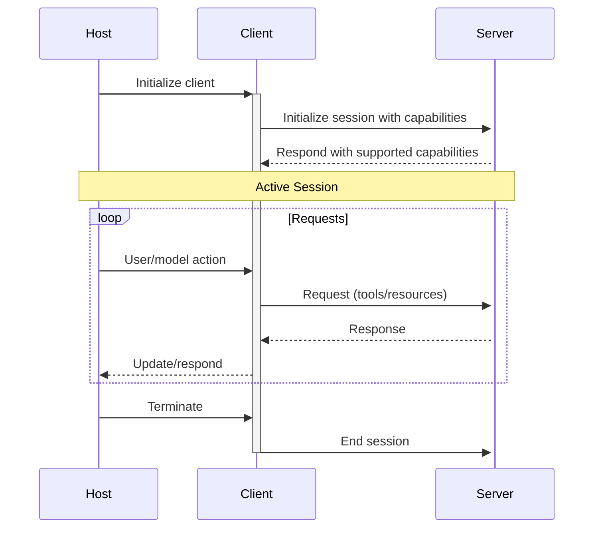

# MCP Architecture

The Model Context Protocol follows a client-host-server architecture that enables AI applications to connect with multiple tools and data sources while maintaining security boundaries.

## Core Components

### Architecture Overview

```
┌─────────────────────────────────────────────┐
│           Application Host Process          │
│                                             │
│  ┌─────────┐                                │
│  │  Host   │                                │
│  └────┬────┘                                │
│       │                                     │
│  ┌────┴────┬──────────┬──────────┐         │
│  │Client 1 │ Client 2 │ Client 3 │         │
│  └────┬────┴─────┬────┴─────┬────┘         │
└───────┼──────────┼──────────┼──────────────┘
        │          │          │
   ┌────▼────┐ ┌──▼────┐ ┌──▼────┐
   │Server 1 │ │Server 2│ │Server 3│
   │Files &  │ │Database│ │External│
   │  Git    │ │        │ │  APIs  │
   └─────────┘ └────────┘ └────────┘
```

### Host

The host process (in Shaman, the agent execution environment) acts as the coordinator:

- Creates and manages multiple MCP client instances
- Controls client connection permissions and lifecycle
- Enforces security policies and consent requirements
- Handles user authorization decisions
- Coordinates AI/LLM integration
- Manages context aggregation across clients

### Clients

Each client maintains an isolated connection to one server:

- Establishes one stateful session per server
- Handles protocol negotiation and capability exchange
- Routes protocol messages bidirectionally
- Manages subscriptions and notifications
- Maintains security boundaries between servers

### Servers

MCP servers provide specialized capabilities:

- Expose resources, tools, and prompts via MCP primitives
- Operate independently with focused responsibilities
- Can request sampling through client interfaces
- Must respect security constraints
- Can be local processes or remote services

## Design Principles

MCP is built on several key principles:

### 1. Servers should be extremely easy to build

- Host applications handle complex orchestration
- Servers focus on specific, well-defined capabilities
- Simple interfaces minimize implementation overhead
- Clear separation enables maintainable code

### 2. Servers should be highly composable

- Each server provides focused functionality in isolation
- Multiple servers can be combined seamlessly
- Shared protocol enables interoperability
- Modular design supports extensibility

### 3. Servers maintain isolation

- Servers receive only necessary contextual information
- Full conversation history stays with the host
- Each server connection maintains isolation
- Cross-server interactions are controlled by the host
- Host process enforces security boundaries

### 4. Progressive feature adoption

- Core protocol provides minimal required functionality
- Additional capabilities can be negotiated as needed
- Servers and clients evolve independently
- Protocol designed for future extensibility
- Backwards compatibility is maintained

## Capability Negotiation

MCP uses capability-based negotiation where clients and servers declare supported features during initialization:

### Server Capabilities

```json
{
  "capabilities": {
    "tools": {
      "listChanged": true
    },
    "resources": {
      "subscribe": true,
      "listChanged": true
    },
    "prompts": {
      "listChanged": true
    },
    "logging": {}
  }
}
```

### Client Capabilities

```json
{
  "capabilities": {
    "sampling": {},
    "roots": {
      "listChanged": true
    },
    "elicitation": {
      "listChanged": true
    }
  }
}
```

## Session Lifecycle



## Communication Flow

### 1. Initialization Phase

1. Host creates client instance
2. Client connects to server
3. Client sends `initialize` request with capabilities
4. Server responds with its capabilities
5. Session is established

### 2. Discovery Phase

1. Client queries available tools/resources/prompts
2. Server provides listings
3. Client caches available capabilities

### 3. Operation Phase

1. Host/Model requests action
2. Client sends appropriate request to server
3. Server processes and responds
4. Client returns result to host

### 4. Notification Phase

Servers can send notifications for:
- Tool list changes
- Resource updates
- Prompt changes

## Security Model

### Trust Boundaries

1. **Host-Client**: Trusted relationship, same process
2. **Client-Server**: Untrusted, requires validation
3. **Server-Resources**: Server's responsibility

### Security Principles

1. **Least Privilege**: Servers only get necessary information
2. **Explicit Consent**: User approves all operations
3. **Isolation**: Servers cannot see other servers' data
4. **Validation**: All server responses are validated

## Implementation in Shaman

### Agent as MCP Client

When a Shaman agent needs to use tools:

1. Agent execution environment acts as the host
2. Creates MCP client for each configured server
3. Discovers available tools from servers
4. Invokes tools based on agent needs
5. Handles responses and errors

### Configuration Example

```yaml
# In agent YAML
mcpServers:
  calculator:
    command: "mcp-server-calculator"
    args: []
    env:
      LOG_LEVEL: "info"
```

### Tool Invocation Flow

```typescript
// 1. Agent decides to use a tool
const toolName = "calculate";
const args = { expression: "2 + 2" };

// 2. Shaman finds appropriate MCP server
const server = mcpServers.find(s => s.hassTool(toolName));

// 3. Invokes tool via MCP protocol
const result = await server.callTool(toolName, args);

// 4. Returns result to agent
return result;
```

## Best Practices

1. **Single Responsibility**: Each server should focus on one domain
2. **Clear Naming**: Use descriptive names for tools and resources
3. **Error Handling**: Provide clear error messages
4. **Documentation**: Document all tools and their parameters
5. **Security**: Validate all inputs and outputs
6. **Performance**: Keep operations efficient and responsive